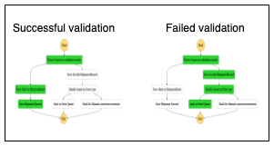
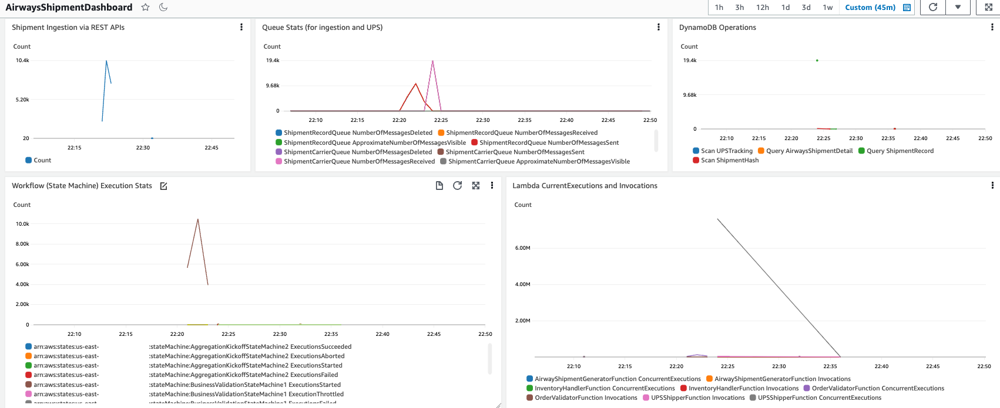

# airway-shipment-orchestrator

This sample project demonstrates airway shipment orchestration using AWS Serverless components including [API Gateway](https://aws.amazon.com/api-gateway/), [Step Functions](https://aws.amazon.com/step-functions/), [Lambda](https://aws.amazon.com/lambda/) along with [SQS](https://aws.amazon.com/sqs/) and [DynamoDB](https://aws.amazon.com/dynamodb/)) to implement complex workflows that integrates automated systems with various decision branches. The use case demonstrates ingestion of multiple shipment requests, validation using business rules, creation of an airway shipment bill per unique destination, aggregating the shipments and invoking UPS for shipping of individual shipment items.

##  Project structure
The project contains source code and supporting files that you can deploy with the SAM CLI to build the sample application. It includes the following files and folders:
* functions - AWS Lambda functions to handle processing of shipments requests from SQS and integration with various backend systems (including UPS shipping api).
* statemachines - Definition for the AWS Step Functions that orchestrates the complex workflow of managing multiple Lambda and nested AWS child Step Functions.
* template.yaml - A SAM template that defines the application's AWS resources.
* testing - folder that contains artillery test configuration script for injecting requests into the system along with CloudWatch dashboard json template for monitoring various resources.

## Architecture
A large batch of shipment requests need to be handled via automation with support for validation of business rules around shipment payload/address information, followed by aggregation based on shipment destination address and generation of associated airway shipment bill, finally with UPS shipping submissions per individual shipment. The source of ingestion would be a via HTTP POST requests published to an Amazon SQS Queue which then kicks off the workflow implemented using Step Functions and mix of other services/resources. The final stage of shipping is decoupled from main workflow to allow decoupling and flexibility. SNS + SQS is used to fire off the shipping workflow portion that allows multiple carrier workflow switching using selection or message attributes, as well as, kick off other processes via SNS publish to SQS/Email/SMS/Lambda/Kinesis.

High level architecture:


### Step Functions:
* `BusinessValidationStateMachine1` initially checks for validation errors and decides on normal processing, or manual resubmission or error processing based on validation errors. It creates an address hash based on shipment address along with a date + random partition hash (as there can be large number of shipments to same destination). It saves the individual records, hashes and shipment address in DynamoDB. Failed validations are passed onto Dead Letter Queue or different queues based on type of validation errors.


* `AggregationKickoffStateMachine2` aggregate the orders based on destination address for further processing once the batch of shipments have been all validated. This has to be kicked off manually once we know the batch of shipment records has been validated and saved. For each unique shipment address in the batch, an instance of `SAWBProcessorStateMachine3` would be created using Step Funtion's Map construct. The AggregationKickoff Step Function invocation has to be done just once per submitted batch with no real inputs required for the AggregationKickoff state machine.


* `SAWBProcessorStateMachine3` handles Airway shipment generation per unique destination address. Then it starts handling the shipments using a Map construct in Step Functions to handle the individual line items associated with an unique shipment address and assigned date + random partition. It takes an input argument of an existing hash of destination addresses partitions.


* `ShipmentPartitionHandlerStateMachine4` associates the Airway shipment bill  with the shipment and then fires off a SNS notification for handling by associated Carriers. The Carrier Notification SNS topic in turn publishes to a Shipment Carrier Queue. There can be multiple  subscribers for the SNS Topic (example: UPS, Fedex, USPS etc.) and each carrier workflow to handle the shipments can work at same time in a disconnected manner as the SNS/SQS decouples it from the main aggregation from actual carrier shipping operations.


* `UPSShipmentHandlerStateMachine5` is the carrier specific workflow to handle the shipments by invoking actual carrier service endpoint and then associating the carrier tracker id and shipping response with the shipment.


### SNS and SQS
* `ShipmentRecordQueue` is an Amazon SQS (Simple Queue Service) Standard Queue used for ingestion of shipment orders. Messages are published to it via API Gateway `AirwaysShipmentRestApi` endpoint. There is a Dead Letter Queue (DLQ) named `ShipmentRecordDLQueue` for failure handling, along with an additional queue for manual resubmissions: `ShipmentRecordManualResubmitQueue` used by the OrderValidation State machine for error handling.

* `ShipmentCarrierTopic` is an Amazon SNS (Simple Notification Service) Topic for notifying various carriers for handling shipments. The Shipment handling workflow publishes messages to the Topic after creating the Airways Shipment bill and aggregating the shipment records. Its publishes messages to a `ShipmentCarrierQueue` SQS Standard Queue for actual processing by the `UPSShipmentHandlerStateMachine5` workflow. There can be different queues with their associated workflows and they can use message filtering to choose which shipments to work on.

### DynamoDB Tables

All the below tables are configured with on-demand capacity to handle large throughput requirements to handle heavy concurrent read/writes.

* `ShipmentHash` contains unique shipment destinations. It uses a hash based on shipment address as DynamoDB partition key along with an additional portion comprised of date and a random partition as sort key to avoid hot keys from repeated addresses.

* `ShipmentRecord` contains the indivivdual shipment records submitted. It uses the shipment address + date + partition (used as sort key earlier in ShipmentHash) as its partition key and the record id as sort key. It would also contain the UPS tracker id along with airway shipment bill id once the carrrier has generated the tracker id.

* `AirwaysShipmentDetail` contains the airway shipment bill generated per unique address against the aggregated shipments for a given batch submission.

* `UPSTracking` contains the UPS Tracker id and associated shipping request/response and the related shipment record id.


### Key API Gateway and Lambda Functions
* `AirwaysShipmentRestAPI` is an AWS APIGateway endpoint that accepts individual shipment records over a REST endpoint for submission to the `ShipmentRecordQueue` SQS Destination.


* `OrderValidationFunction` AWS Lambda Function consumes the shipment records from the `ShipmentRecordQueue` (submitted manually or via API Gateway integration) SQS Queue and validates the records before kicking off the `BusinessValidationStateMachine` for further processing per record.

* `AirwayShipmentGeneratorFunction` generates the airway shipment record while the Inventory/Supplier act as minor function for generating existing inventory and supplier information;

* `ShipmentAddressGrouperFunction` and `ShipmentAddressDateGrouperFunction` are functions to lookup shipments by just destination address or along with the random partition that have not been assocaited with a carrier.

* `UPSShipperFunction` is the UPS shipment handler function invoking UPS. Due to rate limits, it simulates the UPS Shipping response rather than actually hitting the UPS shipping endpoint. To truly invoke UPS, edit the environment variable `SIMULATE` to `false`, and also edit the client API ID and Secret and related Shipper Account Number with valid entries before redeploying the function.

### Detailed Workflow
Detailed architecture:


* Airways Shipment system accepts individual shipment requests via an API endpoint (deployed via SAM template) that gets saved as individual messages in `ShipmentRecordQueue` SQS Queue.
* `OrderValidatorFunction` Lambda function subscribed to the `ShipmentRecordQueue` SQS Queue consumes the batch of messages and starts validating the entries and marks errors as required.
  * For each individual message, the function creates a hash based on the shipping destination address.
  * It then invokes `BusinessValidationStateMachine1` Step Function for each individual message passing along the actual shipment record, address hash along with any validation errors.
* `BusinessValidationStateMachine1` Step Function goes through a decision tree to either process normally, put the record for error handling via a DLQ (`ShipmentRecordDLQueue`) or manual resubmission via  a different queue (`ShipmentRecordManualResubmitQueueName`) based on the error type.
* Fully validated and error free shipments are then saved in DynamoDB Tables. The specific Address Hash is saved in `ShipmentHash` table with status indicating it was not processed while the complete message including the shipment record and addr hash is saved in `ShipmentRecord` table.
* Once all the messages have been validated and saved using the above 2 services, the messages can be aggregated and processed for actual shipment.
* The `AggregationKickoffStateMachine2` is invoked (no need for actual payload) and it queries DynamoDB `ShipmentHash` table for unprocessed unique addresses.
* The list of address hashes along with the random partitions is passed to a Map function.
  * For each unique address hash + partition discovered, a child step function `SAWBProcessorStateMachine3` is invoked to handle the actual airway shipment bill generation and for each entry going to the same address, UPS shipping service needs to be invoked with the relevant payload.
  * `SAWBProcessorStateMachine3` handles generation of the Airway Shipment Bill using Lambda function `AirwayShipmentGeneratorFunction` (the shipment bill gets saved in `AirwaysShipmentDetail` table in DynamoDB) and then checks if inventory is available for that shipment for default supplier and switches the supplier as necessary before passing to another Map step that iterates over the individual shipment entries that are being sent via UPS to the same address.
  * For each shipment, a message is published to the `ShipmentCarrierTopic` Topic that allows the actual carrier to handle the shipping. The Topic publishes to `ShipmentCarrierQueue` which gets picked by a ShipmentCarrier Lambda that in turn triggers UPS Carrier Shipping related workflow service.
  * `UPSShipmentHandlerStateMachine5` gets invoked to handle the Airways shipment bill and record, calls the UPS service and the results get saved in `UPSTracking` table.
  * All the Shipment records with associated UPS or other carrier shipment labels are saved in DynamoDB `ShipmentRecord` table. There is a separate `UPSTracking` table that has the individual tracker id along with related shipping record id. Heavy writes and reads in DynamoDB can result in throttling as DynamoDB atempts to scale the table (when using on-demand capacity). Code attempts to retry with increasing backoff rates.
* Any repeat submissions to the Aggregation Step Function for an already processed address will return with no operations.

## Requirements

* SAM CLI (details in Deploy)
* Needs Python 3.9 available to run the SAM CLI tool (refer to https://tecadmin.net/install-python-3-9-on-amazon-linux/ for instructions).
* Artillery tool to be installed to load test and inject messages into SQS via API Gateway (can be done manually as well). Please refer to [Artillery install](https://www.artillery.io/docs/guides/getting-started/installing-artillery)


## Deploy the sample application

The Serverless Application Model Command Line Interface (SAM CLI) is an extension of the AWS CLI that adds functionality for building and testing Serverless applications.

To use the SAM CLI, you need the following tools:

* SAM CLI - [Install the SAM CLI](https://docs.aws.amazon.com/serverless-application-model/latest/developerguide/serverless-sam-cli-install.html)
* Python 3.9 - [Instructions for install  on Amazon Linux](https://tecadmin.net/install-python-3-9-on-amazon-linux/)
* Docker - [Install Docker community edition](https://hub.docker.com/search/?type=edition&offering=community)

Note: Docker not really required if there is no local dev/test using sam local option.
Switch to different version of Python if necessary by changing version information inside the sam template file (template.yaml)


The `sam build` command will build the source of your application (this requires python v3.9). The `sam deploy --guided` command will package and deploy your application to AWS, with a series of prompts for various parameters. Users can just hit enter to accept the defaults or choose to override the parameters and deploy the application.

* **Stack Name**: The name of the stack to deploy to CloudFormation. This should be unique to your account and region, and a good starting point would be something matching your project name.
* **AWS Region**: The AWS region you want to deploy your app.
* **ShipmentRecordQueueName**: name of the shipment submission SQS Queue; default value: `ShipmentRecordQueue`
* **ShipmentRecordManualResubmitQueueName**: name of the SQS Queue for handling shipment requests manually due to some validation errors; default value: `ShipmentRecordManualResubmitQueue`
* **ShipmentRecordDLQueueName**: name of the SQS Dead Letter Queue for messages that failed validation and cannot be resubmitted manually with minor tweaks; default value: `ShipmentRecordDLQueue`
* **ShipmentHashTableName**: DynamoDB table persisting the unique address hashes; default value: `ShipmentHash`
* **ShipmentRecordTableName**: DynamoDB table persisting the individual shipment records; default value: `ShipmentRecord`
* **AirwaysShipmentDetailTableName**: name of the DynamoDB Table to store the airways shipment detail for each unique shipment address; default value: `AirwaysShipmentDetail`
* **UPSShipmentTrackingTableName**: name of the DynamoDB Table to store the UPS shipping record for each shipment; default value: `UPSTracking`
* **Confirm changes before deploy**: If set to yes, any change sets will be shown to you before execution for manual review. If set to no, the AWS SAM CLI will automatically deploy application changes.
* **Allow SAM CLI IAM role creation**: Many AWS SAM templates, including this example, create AWS IAM roles required for the AWS Lambda function(s) included to access AWS services. By default, these are scoped down to minimum required permissions. To deploy an AWS CloudFormation stack which creates or modifies IAM roles, the `CAPABILITY_IAM` value for `capabilities` must be provided. If permission isn't provided through this prompt, to deploy this example you must explicitly pass `--capabilities CAPABILITY_IAM` to the `sam deploy` command.
* **Save arguments to samconfig.toml**: If set to yes, your choices will be saved to a configuration file inside the project, so that in the future you can just re-run `sam deploy` without parameters to deploy changes to your application.

To build and deploy your application for the first time, run the following in your shell:

```bash
git clone https://github.com/sparameswaran/airway-shipment-orchestrator/
cd airway-shipment-orchestrator

# Run this first and subsequently on making changes to code/templates
sam build
# Check the parameter details
sam deploy --guided
```

## Testing

There are 2 parts to the workflow:
* Ingestion of shipments via API Gateway -> SQS -> Lambda -> OrderValidationStateMachine1
* Kick off the aggregation of shipments and related downstream processing (SAWB generation, association of carrier with the shipments etc.)

*1)* To load test the ingestion at scale, use (artillery)[https://www.artillery.io] to inject sample shipment messages that would be submitted via API Gateway to ShipmentRecordQueue (SQS Queue).

Steps:

* Go to the testing folder.
* Edit the target and load testing configurations in config.json file for API Gateway REST endpoint and load parameters
```
"config": {
  "target": "https://<EDIT_ME_WITH_API_GATEWAY_ENDPOINT>.amazonaws.com",
  "phases": [
    { "name": "Generate Shipment requests", "duration": 1, "arrivalRate": 20 }
  ],
  ....
```
  Edit the target to the API endpoint created at end of the SAM deployment (without any trailing `/` or stage names)
  Edit the `arrivalRate` to be small for initial testing (controls how many requests to submit in a given second)
  The duration parameter indicates how long to run the test which can be bumped up. Total number of submitted requests would be equal to (arrival rate * duration).
  The shipment payload would be dynamically substituted with addresses specified in the sample 200-addresses.csv file.
  Its also possible to submit a request directly to API Gateway endpoint using curl and a sample payload:
  ```bash
  cd testing
  # Edit the AirwaysShipmentApi endpoint before running curl
  curl -X POST -H 'Content-Type: application/json' https://<AirwaysShipmentApiEndpoint>/dev/postShipment -d @sampleShippingPayload.json
  ```

* Start the tests from the `testing folder` using `./runArtillery.sh` script or just run `artillery run config.json`
Whenever making changes to the code or SAM templates, rerun the sam build followed by sam deploy.

*2)* To kick off the aggeregation and processing of the shipments, wait for the shipment records to show up in the ShipmentRecord DDB table. There can a few failed records that goes to the ShipmentRecordDLQueue with rest being successfully inserted into ShipmentRecord table. The total ingestion process should be over in one-two minutes once artillery has completed its run.
* Once this is verified, go to the `AggregationKickoffStateMachine2` Step Function and start a new execution. This would check the ShipmentRecordQueue for zero available messages indicating all have been ingested to start the actual aggregation.
* Wait for the AggregationKickoff to complete.
* Check the `UPSShipmentHandlerStateMachine5` execution stats to see the actual invocation of UPS or other carrier handling the shipping.
* The `ShipmentRecord` table should reflect the updated shipment records along with related UPS tracker ids.
* For repeated runs as necessary, clean up the various tables once testing is done using the `DDBTableCleanupHandlerFunction` Lambda function. To speed up clean of large set of contents in `ShipmentRecord` table that can take time, it tries to directly delete and recreate the tables rather than deleting the records. It just deletes the rows only for smaller tables: `ShipmentHash` and `AirwaysShipmentDetail`.

## Monitoring

Use CloudWatch Dashboard to monitor the various metrics emitted from API Gateway, SQS, Lambda, DynamoDB, Step Functions. Create a new dashboard in CloudWatch. Create a copy of the sample dashboard template from `testing/dashboard.json` and edit the `<AWS_REGION>` and `<AWS_ACCOUNT_ID>` with valid actual region and AWS account values and then import it into the newly created dashboard using the `Actions` -> `View/edit source` option in Dashboard. Overwrite the empty widget/content with the newly edited template contents and save it to apply the changes.


## Cleanup

For repeated runs as necessary, clean up the various tables once testing is completed using the `DDBTableCleanupHandlerFunction` Lambda function. To speed the cleanup of very large `ShipmentRecord` and `UPSTracking` tables that can take time, the Lambda function directly deletes and recreate the tables rather than deleting the records in loop. The overall clean up can take longer upwards of 6-8 minutes depending on content.

To delete the entire application along with resources created, use the AWS CLI. First delete the S3 bucket hosting the batch script. Assuming you used your project name for the stack name, you can run the following:

```
bash
aws s3 rm s3://<airway-shipment-orchestrator-s3bucket> --recursive
aws cloudformation delete-stack --stack-name <stack-name>
```

Delete the DynamoDB tables if these were recreated outside of Cloudformation/SAM CLI manually if necessary as part of the final cleanup.

## Resources

See the [AWS SAM developer guide](https://docs.aws.amazon.com/serverless-application-model/latest/developerguide/what-is-sam.html) for an introduction to SAM specification, the SAM CLI, and serverless application concepts.
