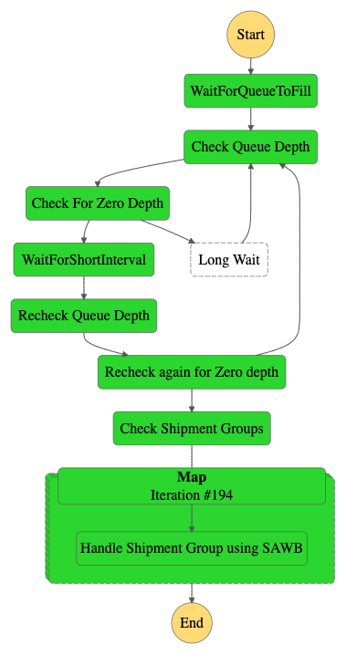
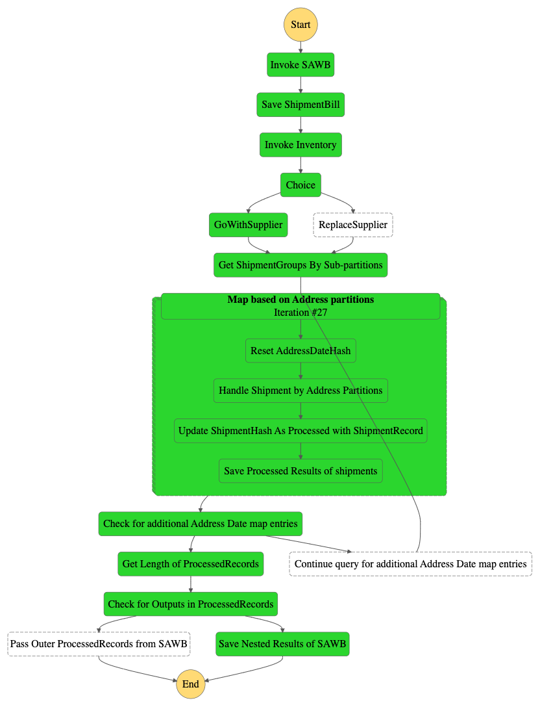

# airway-shipment-orchestrator

This sample project demonstrates orchestration using AWS Serverless components (API Gateway, Step Functions, Lambda along with SQS and DynamoDB) to implement complex workflows that integrates automated systems with various decision branches. The use case demonstrates handling multiple shipment requests that requires creation of an airway shipment bill per unique destination and individualized UPS shipment requests.

##  Project structure
The project contains source code and supporting files that you can deploy with the SAM CLI. It includes the following files and folders:

- functions - AWS Lambda functions to handle processing of shipments requests from SQS and integration with various backend systems (including UPS shipping api).
- statemachines - Definition for the AWS Step Functions that orchestrates the complex workflow of managing multiple Lambda and nested AWS child Step Functions.
- template.yaml - A SAM template that defines the application's AWS resources.
- testing - folder that contains artillery test configuration script for injecting requests into the system.

## Architecture

A large batch of shipment requests need to be handled via automation with support for validation of business rules around shipment payload/address information, followed by aggregation based on shipment destination address and generation of associated airway shipment bill, finally followed by UPS shipping submissions per individual shipment. The source of ingestion would be a AWS SQS Queue and the workflow would be implemented using Step Functions and mix of other services/resources.

High level architecture is shown below:


There are 3 Step Functions involved in the workflow:
* `BusinessValidationStateMachine1` initially checks for validation errors and delegates for manual resubmission or error processing or normal processing of valid shipment requests. It saves the individual records and shipment address as a hash in DynamoDB.


* `AggregationKickoffStateMachine2` that would aggregate the orders based on destination address for further processing once the batch of shipments have been all validated. This has to be kicked off manually once we know the batch of shipment records has been validated and saved. For each unique shipment address in the batch, an instance of `SAWBProcessorStateMachine3` would be created using Step Funtion's Map construct. This invocation has to be done just once per batch with no real inputs required.


* `SAWBProcessorStateMachine3` that handles Airway shipment generation per unique destination address and UPS shipping per line item or shipment record. It uses Map construct in Step Functions to handle the individual line items associated with an unique  shipment address. It takes an input argument of an existing hash of destination address.


Lambda Functions used by the workflow. The `OrderValidationFunction` consumes the shipment records from the `ShipmentRecordQueue` (submitted manually or via API Gateway integration) SQS Queue and validates the records before kicking off the `BusinessValidationStateMachine` for further processing per record.

The AirwayShipmentGeneratorFunction generates the airway shipment record while the Inventory/Supplier act as minor functions for generating actual inventory and supplier information while the UPSShipperFunction simulates the actual UPS service. Real UPS service can be used (with valid API Client ID and Secret tokens) but the requests would be throttled for a test account and so it was decided to go with simulated response.


### Detailed Workflow
* Airways Shipment system accepts individual shipment requests via an API endpoint (deployed via SAM template) that gets saved as individual messages in `ShipmentRecordQueue` SQS Queue.
* `OrderValidatorFunction` Lambda function subscribed to the `ShipmentRecordQueue` SQS Queue consumes the batch of messages and starts validating the entries and marks errors as required.
  * For each individual message, the function creates a hash based on the shipping destination address.
  * It then invokes `BusinessValidationStateMachine1` Step Function for each individual message passing along the actual shipment record, address hash along with any validation errors.
* `BusinessValidationStateMachine1` Step Function goes through a decision tree to either process normally, put the record for error handling via a DLQ (`ShipmentRecordDLQueue`) or manual resubmission via  a different queue (`ShipmentRecordManualResubmitQueueName`) based on the error type.
* Fully validated and error free shipments are then saved in DynamoDB Tables. The specific Address Hash is saved in `ShipmentHash` table with status indicating it was not processed while the complete message including the shipment record and addr hash is saved in `ShipmentRecord` table.
* Once all the messages have been validated and saved using the above 2 services, the messages can be aggregated and processed for actual shipment.
* The `AggregationKickoffStateMachine2` is invoked (no need for actual payload) and it queries DynamoDB `ShipmentHash` table for unprocessed unique addresses.
* The list of address hashes is passed to a Map function.
  * For each unique address hash discovered, a child step function `SAWBProcessorStateMachine3` is invoked to handle the actual airway shipment bill generation and for each entry going to the same address, UPS shipping service is invoked with the relevant payload.
  * `SAWBProcessorStateMachine3` handles generation of the Airway Shipment Bill using Lambda function `AirwayShipmentGeneratorFunction` (the shipment bill gets saved in `AirwaysShipmentDetail` table in DynamoDB) and then checks if inventory is available for that shipment for default supplier and switches the supplier as necessary before passing to another Map step that iterates over the individual shipment entries that are being sent via UPS to the same address.
  * For each shipment, UPS Shipping service is invoked passing along the Airways shipment bill and the results get saved in `UPSTracking` table.
* The final list of shipment entries processed gets returned back from the Aggregator Step Function.
* Any repeat submissions to the Aggregation Step Function for an already processed address will return with no operations.

## Requirements

* SAM CLI (details in Deploy)
* Needs Python 3.9 available to run the SAM CLI tool (refer to https://tecadmin.net/install-python-3-9-on-amazon-linux/ for instructions).
* Artillery tool to be installed to load test and inject messages into SQS via API Gateway (can be done manually as well). Please refer to [Artillery install](https://www.artillery.io/docs/guides/getting-started/installing-artillery)


## Deploy the sample application

The Serverless Application Model Command Line Interface (SAM CLI) is an extension of the AWS CLI that adds functionality for building and testing Serverless applications.

To use the SAM CLI, you need the following tools:

* SAM CLI - [Install the SAM CLI](https://docs.aws.amazon.com/serverless-application-model/latest/developerguide/serverless-sam-cli-install.html)
* [Python 3.9 installed](https://tecadmin.net/install-python-3-9-on-amazon-linux/)
* Docker - [Install Docker community edition](https://hub.docker.com/search/?type=edition&offering=community)

Note: Docker not really required if there is no local dev/test using sam local option.
Switch to different version of Python if necessary by changing version information inside the sam template file (template.yaml)


The `sam build` command will build the source of your application. The `sam deploy --guided` command will package and deploy your application to AWS, with a series of prompts for various parameters:

* **Stack Name**: The name of the stack to deploy to CloudFormation. This should be unique to your account and region, and a good starting point would be something matching your project name.
* **AWS Region**: The AWS region you want to deploy your app.
* **ShipmentRecordQueueName**: name of the shipment submission SQS Queue; default value: `ShipmentRecordQueue`
* **ShipmentRecordManualResubmitQueueName**: name of the SQS Queue for handling shipment requests manually due to some validation errors; default value: `ShipmentRecordManualResubmitQueue`
* **ShipmentRecordDLQueueName**: name of the SQS Dead Letter Queue for messages that failed validation and cannot be resubmitted manually with minor tweaks; default value: `ShipmentRecordDLQueue`
* **ShipmentHashTableName**: DynamoDB table persisting the unique address hashes; default value: `ShipmentHash`
* **ShipmentRecordTableName**: DynamoDB table persisting the individual shipment records; default value: `ShipmentRecord`
* **AirwaysShipmentDetailTableName**: name of the DynamoDB Table to store the airways shipment detail for each unique shipment address; default value: `AirwaysShipmentDetail`
* **UPSShipmentTrackingTableName**: name of the DynamoDB Table to store the UPS shipping record for each shipment; default value: `UPSTracking`
* **Confirm changes before deploy**: If set to yes, any change sets will be shown to you before execution for manual review. If set to no, the AWS SAM CLI will automatically deploy application changes.
* **Allow SAM CLI IAM role creation**: Many AWS SAM templates, including this example, create AWS IAM roles required for the AWS Lambda function(s) included to access AWS services. By default, these are scoped down to minimum required permissions. To deploy an AWS CloudFormation stack which creates or modifies IAM roles, the `CAPABILITY_IAM` value for `capabilities` must be provided. If permission isn't provided through this prompt, to deploy this example you must explicitly pass `--capabilities CAPABILITY_IAM` to the `sam deploy` command.
* **Save arguments to samconfig.toml**: If set to yes, your choices will be saved to a configuration file inside the project, so that in the future you can just re-run `sam deploy` without parameters to deploy changes to your application.

To build and deploy your application for the first time, run the following in your shell:

```bash
git clone https://github.com/sparameswaran/airway-shipment-orchestrator/
cd airway-shipment-orchestrator

# Run this first and subsequently on making changes to code/templates
sam build
# Check the parameter details
sam deploy --guided
```

## Testing

Use artillery to inject sample shipment messages that would be submitted via API Gateway to ShipmentRecordQueue (SQS Queue).
Steps:

* Go to the testing folder.
* Edit the target and load testing configurations in config.json file
```
"config": {
  "target": "https://EDIT_ME_.execute-api.us-east-1.amazonaws.com",
  "phases": [
    { "duration": 1, "arrivalRate": 20 }
  ],
  ....
```
  Edit the target to the API endpoint created at end of the SAM template deployment (without /dev or other stage name)
  Edit the `arrivalRate` to be small for initial testing (controls how many requests to submit in a given second)
  The duration parameter indicates how long to run the test. Can bump this up. Total requests would be arrival rate * duration.
  The shipment payload to be dynamically submitted with addresses specified in the sample 200-addresses.csv file.
  Its also possible to submit a request directly to API Gateway endpoint using curl and a sample payload:
  ```bash
  cd testing
  # Edit the AirwaysShipmentApi endpoint before running curl
  curl -X POST -H 'Content-Type: application/json' https://<AirwaysShipmentApiEndpoint>/dev/postShipment -d @sampleShippingPayload.json
  ```

* Start the tests from the `testing folder` using `./runArtillery.sh` script or just run `artillery run config.json`
Whenever making changes to the code or SAM templates, rerun the sam build followed by sam deploy.

## Cleanup

To delete the sample application that you created, use the AWS CLI. First delete the S3 bucket hosting the batch script. Assuming you used your project name for the stack name, you can run the following:

```
bash
aws s3 rm s3://<airway-shipment-orchestrator-s3bucket> --recursive
aws cloudformation delete-stack --stack-name <stack-name>
```

## Resources

See the [AWS SAM developer guide](https://docs.aws.amazon.com/serverless-application-model/latest/developerguide/what-is-sam.html) for an introduction to SAM specification, the SAM CLI, and serverless application concepts.
